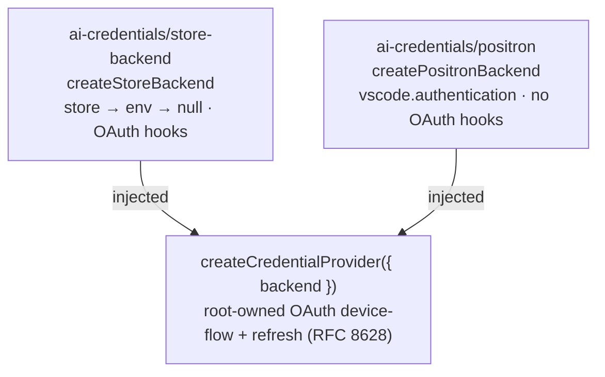

# Credential Resolver & Persisted Formats

This document covers the resolver half of `ai-credentials`: how a provider ID
becomes usable token material, how acquisition attempts and stored records stay
consistent, and the contracts that are persisted to disk. The store primitive
itself (`SingleFileStore`), entrypoint purity invariants, and disk I/O
guarantees are covered in [aiCredentialStore.md](./aiCredentialStore.md).

## The credential resolver surface

The public seam separates interactive acquisition from the runtime credential
material consumed by model clients:

- `getCredentials(providerId)` is the resolution path for every source and
  returns only bridge-ready material.
- `startAuthentication(providerId)` returns a device-code or authorization-code
  challenge with an opaque attempt ID. A second process-local attempt for the
  same provider returns `already-in-progress`.
- `cancelAuthentication(attemptId)` is attempt-scoped.
- Store-backed consumers receive `MutableCredentialProvider`, whose
  `mutateCredentials()` accepts replace/clear operations plus an atomic AWS
  update operation. The AWS operation updates region/profile while explicitly
  preserving, replacing, or clearing manual keys under the store lock;
  configuration UIs can therefore edit non-secret settings without receiving or
  accidentally erasing stored secrets. Disk records, generations, readiness,
  tombstones, and file locks do not escape that module.
- The backend injects grant configuration and an authorization-code receiver.
  The acquisition engine owns PKCE S256, state, polling, exchanges, token
  validation, proactive refresh, refresh-token rotation, and process-local M2M
  caching without provider-name branches.

The older `getAccessToken` and `startDeviceAuth` methods remain temporary
source-compatibility adapters while downstream consumers migrate; when
generalized acquisition hooks are present they route through that same
controller, so compatibility calls share its one-attempt and generation
guarantees.

`createCredentialProvider({ backend })` wraps any `Backend` into the full
`CredentialProvider` resolver surface, returning a `CredentialProviderHandle`:

```
getCredentials(providerId): Promise<ProviderCredentials | null>
getAccessToken(providerId): Promise<string | null>
startDeviceAuth(providerId): Promise<DeviceAuthInfo>
onDidChangeCredentials(cb: (providerIds: string[]) => void): Disposable
cancelDeviceAuth(providerId): void   // cancel in-flight polling, e.g. on logout
dispose(): Promise<void>             // durably terminalizes active attempts
```

Provider IDs are plain **strings** (`ResolvedProviderId`) so custom catalog
providers (branded `CustomProviderId` from `ai-config`) are first-class without
an `ai-credentials → ai-config` import edge.

Routing inside `createCredentialProvider`:

- `getCredentials` — device-flow OAuth providers (the backend exposes
  `oauth.configForProvider(id)`) route through `getAccessToken` and wrap the
  token as `{ type: "oauth", accessToken }`; everything else defers to
  `backend.getCredentials`.
- `getAccessToken` / `startDeviceAuth` — compatibility adapters over the
  generalized acquisition controller when available; the legacy device engine
  is instantiated only for older injected backends that have no generalized
  acquisition hooks. A provider handle therefore never owns two acquisition
  controllers.

## Backends — the host-selected material seam

A `Backend` yields runtime credential _material_ for a provider and, for
device-flow OAuth providers, supplies OAuth _config_ + token _persistence_
hooks. **Host selection is a build-time choice** via conditional exports;
`vscode` never loads outside Positron.



| Backend          | Used by                          | Behavior                                                                                                                                                                                                                                                                        |
| ---------------- | -------------------------------- | ------------------------------------------------------------------------------------------------------------------------------------------------------------------------------------------------------------------------------------------------------------------------------- |
| `/store-backend` | Node hosts, standalone consumers | Resolves `store → env → null`, maps persisted → runtime credentials, and supplies the OAuth hooks (device-flow providers persist tokens through the injected `StoreBackendStorage`).                                                                                            |
| `/positron`      | Positron extension               | Wraps `vscode.authentication`; shapes the raw session token via `/types` `shapeCredentials`. **No** OAuth hooks — Positron's auth extension owns sign-in, so OAuth providers resolve through `getCredentials`. Also exposes `getCredentialsWithPrompt` (deliberate sign-in UX). |

The `/store-backend` needs neither the provider registry nor the catalog:
`resolveAuthMethod(providerId)` (which auth method a provider uses) and
`oauthConfigForProvider(providerId)` are **injected** by the consumer.

### Root-owned OAuth acquisition and refresh

The provider-agnostic acquisition engine lives in the root (`acquisition.ts`).
It supports RFC 8628 device code, authorization code with PKCE S256, client
credentials, and refresh grants. A per-provider mutex and jittered
proactive-refresh window prevent duplicate renewal in one process. The store
backend adds a provider-scoped transaction around stored refresh: check, lock,
re-read, adopt another process's result when possible, otherwise refresh and
persist the rotated token. Environment M2M tokens never enter that transaction
because their derived tokens live only in process memory.

## Databricks source and concurrency model

Databricks keeps the stable `auth:databricks:apikey` storage key and always
resolves to `{ type: "apikey", apiKey: bearerToken, baseUrl: workspaceHost }`.
Runtime material therefore does not expose whether the bearer came from a PAT,
U2M, or M2M grant.

After tolerant Zod parsing, the store backend normalizes each record into
exactly one active source: legacy/PAT `apiKeyAuth`, U2M `oauthAuth`, or stored
M2M `clientCredentialsAuth`. Explicit stored credentials win over environment
credentials. With environment-only configuration, `DATABRICKS_TOKEN` wins
unless `DATABRICKS_AUTH_TYPE=oauth-m2m`; environment M2M requires
`DATABRICKS_HOST`, `DATABRICKS_CLIENT_ID`, and `DATABRICKS_CLIENT_SECRET`.
Status exposes only source, origin, readiness, expiry, and sanitized workspace
metadata.

The Databricks entry in `PROVIDER_ENV_MAPPINGS` declares both PAT and M2M
names. `StoreBackend` reads M2M fields through that mapping, and
`captureProviderEnvironment` enumerates the same fields, so an authenticated
host cannot omit `DATABRICKS_CLIENT_SECRET` from its capture/scrub inventory.

Every upgraded store mutation re-reads under the injected storage's `withLock()` and
writes a fresh opaque generation. Starting stored OAuth writes a token-free
`pending` record and captures its generation. Completion commits only if that
generation is still current; configure, source switch, clear, cancellation,
timeout, and failure replace it, so stale callbacks cannot resurrect
credentials. Clear writes a generation-bearing tombstone. A generationless
write from an older binary invalidates an upgraded attempt; an exactly
overlapping legacy writer does not honor the advisory lock and remains
last-writer-wins.

Attempt ownership is deliberately split: `ai-credentials` owns provider-scoped
process-local attempt state and durable generation validity, while host
applications own which session initiated each attempt (credential changes are
multicast to all sessions). Loopback U2M has two fail-closed gates: the
platform must guarantee browser/backend colocation, and the Databricks
client/redirect/scopes must have release approval. The second prerequisite is
currently unresolved, so production U2M is disabled even on hosts that satisfy
the first gate. M2M and PAT remain available everywhere.

The Databricks protocol implementation belongs in this package. Positron PR
#14898 predates that seam and carries a companion copy; its follow-up should
consume `ai-credentials` when ai-lib can be distributed into that repository.
Until then, changes to client ID, redirect URI, scopes, discovery fallback, or
token validation must be mirrored explicitly rather than allowed to diverge
silently.

## Shared vocabulary in the pure `/types` entry

Three pieces live in `/types` specifically so platform-agnostic consumers can
import them (only pure entries are browser/test-safe) and so custom providers
resolve without any host-application import:

- **`storageKeyFor(providerId, authMethodId)`** — the canonical
  `auth:{providerId}:{authMethodId}` storage-key scheme. Consumers derive their
  storage keys from this helper rather than hand-authoring them.
  **STABLE PERSISTED IDENTIFIER** — renaming without a migration orphans
  existing credentials on disk.
- **OAuth protocol/runtime types (`DeviceAuthInfo`, `TokenData`)** — canonical
  definitions live here; consumers may re-export them for their own call sites.
- **Custom-provider auth descriptors (`CUSTOM_CLIENT_KIND_AUTH_MAP`,
  `SUPPORTED_CUSTOM_CLIENT_KINDS`)** — map a custom provider's `clientKind` to
  `{ authMethodId, apiKeyOptional }`. The map is keyed by plain strings (not
  `ai-config`'s `ClientKind` type) to preserve the no-import-edge boundary; a
  compile-time shape guard in `typechecks/` asserts
  `SUPPORTED_CUSTOM_CLIENT_KIND_VALUES ⊆ CLIENT_KIND_VALUES`. Custom
  `anthropic`, `openai`, and `gemini` map to required `apikey` auth;
  product-bound `positai`, `copilot`, and `databricks` remain excluded.

## On-disk format — `StoredProviderCredentials`

The persisted credential shape (`~/.posit/ai/auth/data.json`) lives in
`/store-backend`, guarded by a **tolerant Zod schema**
(`storedProviderCredentialsSchema`) rather than a compile-time shape guard. It
is intentionally independent from the runtime `ProviderCredentials` union — the
two evolve independently, and the backend converts between them.

**v1 compatibility:** no stored version field. The schema parses **tolerantly**
(all fields optional), so existing records parse unchanged and `data.json`
needs no envelope or migration. Optional credential groups may be added
without rewriting legacy records.
Structurally invalid records (e.g. an `apiKeyAuth` missing its required
`apiKey`) are dropped rather than flowing out as credentials.

Custom AWS providers persist manual secrets in `awsKeys`
(`accessKeyId`, `secretAccessKey`, optional `sessionToken`) without duplicating
catalog-owned region/profile. `createStoreBackend` receives the host callback
`awsConnectionForProvider(providerId)` and combines those two sources only when
a region is available, preserving the backend's complete-runtime-credentials
contract. Existing complete `awsAuth` records remain unchanged and win if a
hand-edited record contains both groups until the next keys-only mutation. AWS
mutations keep the groups mutually exclusive: `update-aws-keys` preservation
converts complete legacy manual keys to `awsKeys`, and clearing writes an
unauthenticated tombstone. The tombstone lets host catalog credential-chain
synthesis resume without leaving a missing key that a host's legacy-store
migration could repopulate. The built-in Bedrock `update-aws` path remains the
complete-record path.

- The generic `SingleFileStore` is **untouched** — a reserved top-level key
  would leak into every `keys()` enumeration, so no version marker is stored
  inline.
- `/store-backend` enumerates credentials by the `auth:` key prefix, so a
  future backend-owned meta record (under a distinct key) would be naturally
  ignored by credential iteration.
- Because the disk format lives in this package, disk-format changes in a
  submodule consumer require an `ai-lib` commit + gitlink bump. This is the
  trade for host-application independence.

## Env resolver + provider env mappings

`resolveCredentialsFromEnv` / `hasEnvCredentials` and `PROVIDER_ENV_MAPPINGS`
(+ `ProviderEnvMapping`) live in `/store-backend` so the `store → env → null`
fallback needs nothing from any host application. For AWS, `hasEnvCredentials`
requires secret key material: `AWS_REGION` alone remains non-secret connection
config and is not credential evidence for auth readiness.

`providerEnvMappings.ts` has a `-external` variant (empty map — positai has no
secret env vars), redirected by the consuming app's build config.

`captureProviderEnvironment(providerIds, env)` is the boot-time capture seam
for authenticated hosts that scrub their ambient environment. It statically
derives the selected providers' declared credential names from the same mapping
the lazy resolver uses and returns those names plus a frozen, minimal
environment snapshot. The host owns any additional curated names, deletion
policy, and the capture-before-scrub ordering; the backend receives the captured
snapshot through `createStoreBackend({ env })`.

## Related Documentation

- **aiCredentialStore.md** — the `SingleFileStore` primitive, entrypoint
  purity invariants, atomic writes, locking, watching
- **architecture.md** (ai-provider-bridge) — how the bridge consumes
  `ProviderCredentials` and the `CredentialProvider` interface
- Consumer-side integration (auth services, session ownership, Snowflake
  `connections.toml` auth) is documented in the Posit Assistant monorepo's
  `memory-bank/aiCredentials.md`
